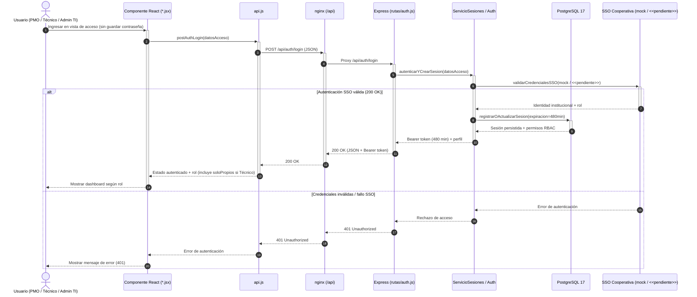

## CU-01: Iniciar sesión con SSO

```mermaid
sequenceDiagram
    autonumber
    actor User as Usuario (PMO / Técnico / Admin TI)
    participant UI as Componente React (*.jsx)
    participant Api as api.js
    participant Nginx as nginx (/api)
    participant Express as Express (rutas/auth.js)
    participant Negocio as ServicioSesiones / Auth
    participant DB as PostgreSQL 17
    participant SSO as SSO Cooperativa (mock / <<pendiente>>)

    User->>+UI: Ingresar en vista de acceso (sin guardar contraseña)
    UI->>+Api: postAuthLogin(datosAcceso)
    Api->>+Nginx: POST /api/auth/login (JSON)
    Nginx->>+Express: Proxy /api/auth/login
    Express->>+Negocio: autenticarYCrearSesion(datosAcceso)
    Negocio->>+SSO: validarCredencialesSSO(mock / <<pendiente>>)

    alt Autenticación SSO válida (200 OK)
        SSO-->>-Negocio: Identidad institucional + rol
        Negocio->>+DB: registrarOActualizarSesion(expiracion=480min)
        DB-->>-Negocio: Sesión persistida + permisos RBAC
        Negocio-->>-Express: Bearer token (480 min) + perfil
        Express-->>-Nginx: 200 OK (JSON + Bearer token)
        Nginx-->>-Api: 200 OK
        Api-->>-UI: Estado autenticado + rol (incluye soloPropios si Técnico)
        UI-->>-User: Mostrar dashboard según rol
    else Credenciales inválidas / fallo SSO
        SSO-->>Negocio: Error de autenticación
        Negocio-->>Express: Rechazo de acceso
        Express-->>Nginx: 401 Unauthorized
        Nginx-->>Api: 401 Unauthorized
        Api-->>UI: Error de autenticación
        UI-->>User: Mostrar mensaje de error (401)
    end
```
