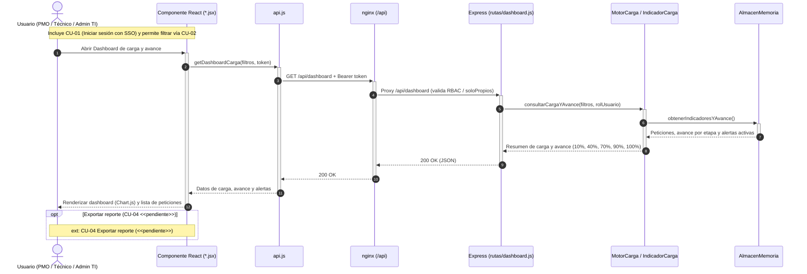

## CU-03: Consultar dashboard de carga y avance

```mermaid
sequenceDiagram
    autonumber
    actor User as Usuario (PMO / Técnico / Admin TI)
    participant UI as Componente React (*.jsx)
    participant Api as api.js
    participant Nginx as nginx (/api)
    participant Express as Express (rutas/dashboard.js)
    participant Negocio as MotorCarga / IndicadorCarga
    participant Cache as AlmacenMemoria

    Note over User,UI: Incluye CU-01 (Iniciar sesión con SSO) y permite filtrar vía CU-02

    User->>+UI: Abrir Dashboard de carga y avance
    UI->>+Api: getDashboardCarga(filtros, token)
    Api->>+Nginx: GET /api/dashboard + Bearer token
    Nginx->>+Express: Proxy /api/dashboard (valida RBAC / soloPropios)
    Express->>+Negocio: consultarCargaYAvance(filtros, rolUsuario)
    Negocio->>+Cache: obtenerIndicadoresYAvance()
    Cache-->>-Negocio: Peticiones, avance por etapa y alertas activas
    Negocio-->>-Express: Resumen de carga y avance (10%, 40%, 70%, 90%, 100%)
    Express-->>-Nginx: 200 OK (JSON)
    Nginx-->>-Api: 200 OK
    Api-->>-UI: Datos de carga, avance y alertas
    UI-->>-User: Renderizar dashboard (Chart.js) y lista de peticiones

    opt Exportar reporte (CU-04 <<pendiente>>)
        Note over User,UI: ext: CU-04 Exportar reporte (<<pendiente>>)
    end
```
