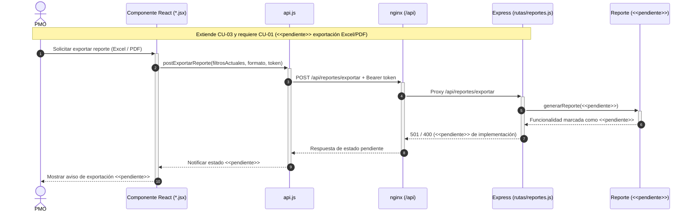

## CU-04: Exportar reporte (<<pendiente>>)

```mermaid
sequenceDiagram
    autonumber
    actor PMO as PMO
    participant UI as Componente React (*.jsx)
    participant Api as api.js
    participant Nginx as nginx (/api)
    participant Express as Express (rutas/reportes.js)
    participant Negocio as Reporte (<<pendiente>>)

    Note over PMO,Express: Extiende CU-03 y requiere CU-01 (<<pendiente>> exportación Excel/PDF)

    PMO->>+UI: Solicitar exportar reporte (Excel / PDF)
    UI->>+Api: postExportarReporte(filtrosActuales, formato, token)
    Api->>+Nginx: POST /api/reportes/exportar + Bearer token
    Nginx->>+Express: Proxy /api/reportes/exportar
    Express->>+Negocio: generarReporte(<<pendiente>>)
    Negocio-->>-Express: Funcionalidad marcada como <<pendiente>>
    Express-->>-Nginx: 501 / 400 (<<pendiente>> de implementación)
    Nginx-->>-Api: Respuesta de estado pendiente
    Api-->>-UI: Notificar estado <<pendiente>>
    UI-->>-PMO: Mostrar aviso de exportación <<pendiente>>
```
