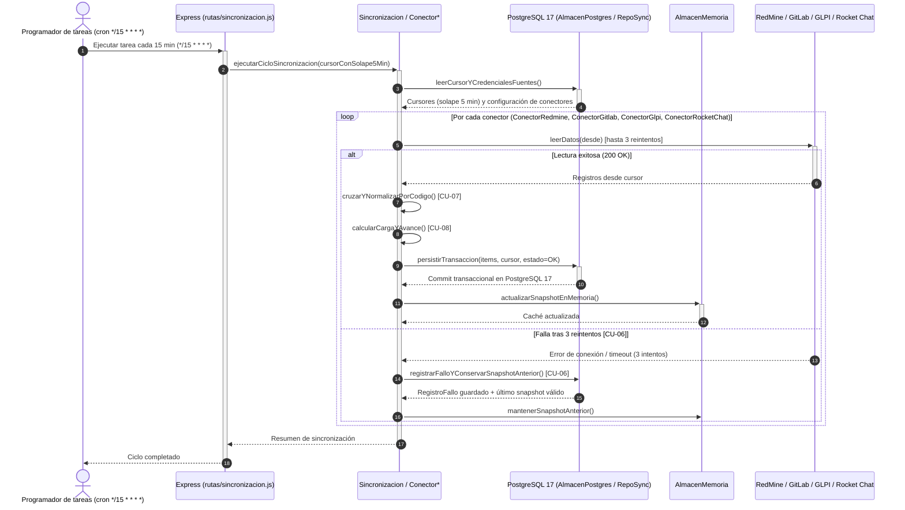

## CU-05: Sincronizar fuentes (cron */15 * * * *)

```mermaid
sequenceDiagram
    autonumber
    actor Cron as Programador de tareas (cron */15 * * * *)
    participant Express as Express (rutas/sincronizacion.js)
    participant Sync as Sincronizacion / Conector*
    participant DB as PostgreSQL 17 (AlmacenPostgres / RepoSync)
    participant Cache as AlmacenMemoria
    participant Externos as RedMine / GitLab / GLPI / Rocket Chat

    Cron->>+Express: Ejecutar tarea cada 15 min (*/15 * * * *)
    Express->>+Sync: ejecutarCicloSincronizacion(cursorConSolape5Min)
    Sync->>+DB: leerCursorYCredencialesFuentes()
    DB-->>-Sync: Cursores (solape 5 min) y configuración de conectores

    loop Por cada conector (ConectorRedmine, ConectorGitlab, ConectorGlpi, ConectorRocketChat)
        Sync->>+Externos: leerDatos(desde) [hasta 3 reintentos]

        alt Lectura exitosa (200 OK)
            Externos-->>-Sync: Registros desde cursor
            Sync->>Sync: cruzarYNormalizarPorCodigo() [CU-07]
            Sync->>Sync: calcularCargaYAvance() [CU-08]
            Sync->>+DB: persistirTransaccion(items, cursor, estado=OK)
            DB-->>-Sync: Commit transaccional en PostgreSQL 17
            Sync->>+Cache: actualizarSnapshotEnMemoria()
            Cache-->>-Sync: Caché actualizada
        else Falla tras 3 reintentos [CU-06]
            Externos-->>Sync: Error de conexión / timeout (3 intentos)
            Sync->>DB: registrarFalloYConservarSnapshotAnterior() [CU-06]
            DB-->>Sync: RegistroFallo guardado + último snapshot válido
            Sync->>Cache: mantenerSnapshotAnterior()
        end
    end

    Sync-->>-Express: Resumen de sincronización
    Express-->>-Cron: Ciclo completado
```
