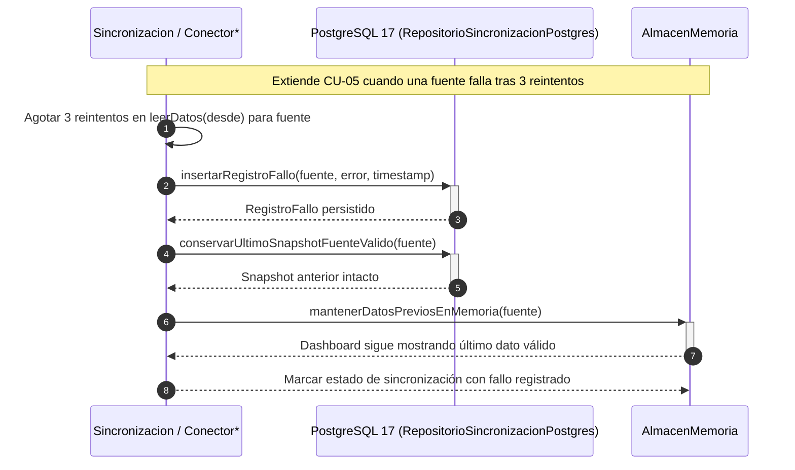

## CU-06: Registrar fallo de fuente

```mermaid
sequenceDiagram
    autonumber
    participant Sync as Sincronizacion / Conector*
    participant DB as PostgreSQL 17 (RepositorioSincronizacionPostgres)
    participant Cache as AlmacenMemoria

    Note over Sync,Cache: Extiende CU-05 cuando una fuente falla tras 3 reintentos

    Sync->>Sync: Agotar 3 reintentos en leerDatos(desde) para fuente
    Sync->>+DB: insertarRegistroFallo(fuente, error, timestamp)
    DB-->>-Sync: RegistroFallo persistido
    Sync->>+DB: conservarUltimoSnapshotFuenteValido(fuente)
    DB-->>-Sync: Snapshot anterior intacto
    Sync->>+Cache: mantenerDatosPreviosEnMemoria(fuente)
    Cache-->>-Sync: Dashboard sigue mostrando último dato válido
    Sync-->>Cache: Marcar estado de sincronización con fallo registrado
```
