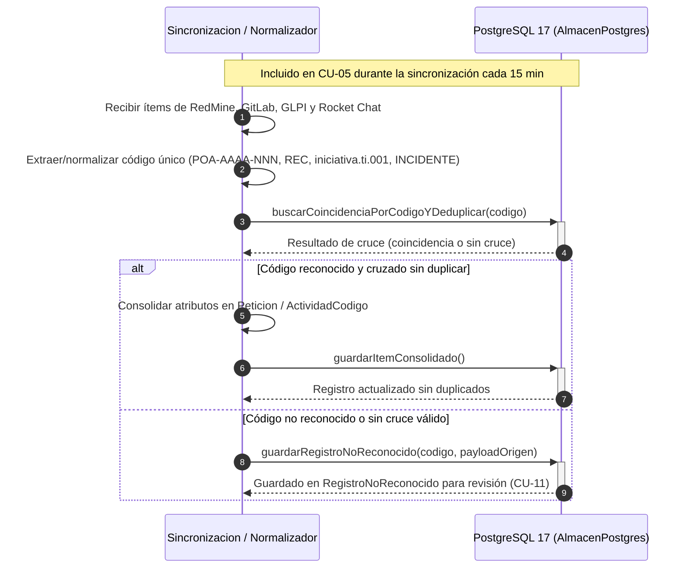

## CU-07: Cruzar datos por código

```mermaid
sequenceDiagram
    autonumber
    participant Sync as Sincronizacion / Normalizador
    participant DB as PostgreSQL 17 (AlmacenPostgres)

    Note over Sync,DB: Incluido en CU-05 durante la sincronización cada 15 min

    Sync->>Sync: Recibir ítems de RedMine, GitLab, GLPI y Rocket Chat
    Sync->>Sync: Extraer/normalizar código único (POA-AAAA-NNN, REC, iniciativa.ti.001, INCIDENTE)
    Sync->>+DB: buscarCoincidenciaPorCodigoYDeduplicar(codigo)
    DB-->>-Sync: Resultado de cruce (coincidencia o sin cruce)

    alt Código reconocido y cruzado sin duplicar
        Sync->>Sync: Consolidar atributos en Peticion / ActividadCodigo
        Sync->>+DB: guardarItemConsolidado()
        DB-->>-Sync: Registro actualizado sin duplicados
    else Código no reconocido o sin cruce válido
        Sync->>+DB: guardarRegistroNoReconocido(codigo, payloadOrigen)
        DB-->>-Sync: Guardado en RegistroNoReconocido para revisión (CU-11)
    end
```
