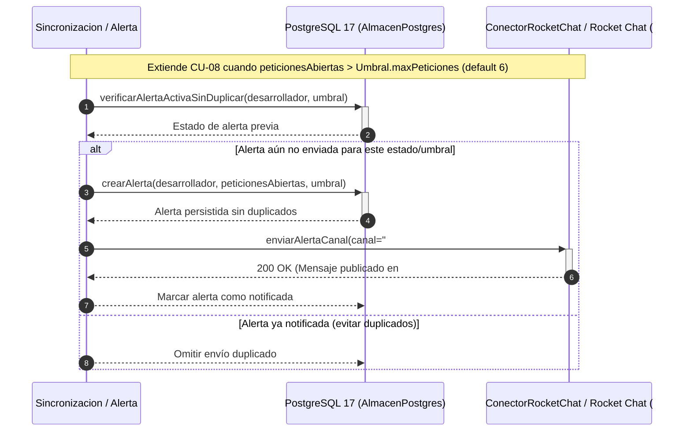

## CU-09: Enviar alerta

```mermaid
sequenceDiagram
    autonumber
    participant Sync as Sincronizacion / Alerta
    participant DB as PostgreSQL 17 (AlmacenPostgres)
    participant Chat as ConectorRocketChat / Rocket Chat (#ti-alertas)

    Note over Sync,Chat: Extiende CU-08 cuando peticionesAbiertas > Umbral.maxPeticiones (default 6)

    Sync->>+DB: verificarAlertaActivaSinDuplicar(desarrollador, umbral)
    DB-->>-Sync: Estado de alerta previa

    alt Alerta aún no enviada para este estado/umbral
        Sync->>+DB: crearAlerta(desarrollador, peticionesAbiertas, umbral)
        DB-->>-Sync: Alerta persistida sin duplicados
        Sync->>+Chat: enviarAlertaCanal(canal="#ti-alertas", mensaje)
        Chat-->>-Sync: 200 OK (Mensaje publicado en #ti-alertas)
        Sync-->>DB: Marcar alerta como notificada
    else Alerta ya notificada (evitar duplicados)
        Sync-->>DB: Omitir envío duplicado
    end
```
