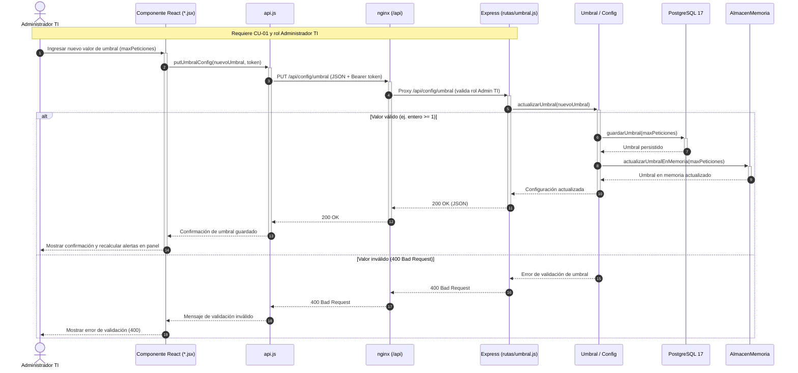

## CU-10: Configurar umbral

```mermaid
sequenceDiagram
    autonumber
    actor Admin as Administrador TI
    participant UI as Componente React (*.jsx)
    participant Api as api.js
    participant Nginx as nginx (/api)
    participant Express as Express (rutas/umbral.js)
    participant Negocio as Umbral / Config
    participant DB as PostgreSQL 17
    participant Cache as AlmacenMemoria

    Note over Admin,Express: Requiere CU-01 y rol Administrador TI

    Admin->>+UI: Ingresar nuevo valor de umbral (maxPeticiones)
    UI->>+Api: putUmbralConfig(nuevoUmbral, token)
    Api->>+Nginx: PUT /api/config/umbral (JSON + Bearer token)
    Nginx->>+Express: Proxy /api/config/umbral (valida rol Admin TI)
    Express->>+Negocio: actualizarUmbral(nuevoUmbral)

    alt Valor válido (ej. entero >= 1)
        Negocio->>+DB: guardarUmbral(maxPeticiones)
        DB-->>-Negocio: Umbral persistido
        Negocio->>+Cache: actualizarUmbralEnMemoria(maxPeticiones)
        Cache-->>-Negocio: Umbral en memoria actualizado
        Negocio-->>-Express: Configuración actualizada
        Express-->>-Nginx: 200 OK (JSON)
        Nginx-->>-Api: 200 OK
        Api-->>-UI: Confirmación de umbral guardado
        UI-->>-Admin: Mostrar confirmación y recalcular alertas en panel
    else Valor inválido (400 Bad Request)
        Negocio-->>Express: Error de validación de umbral
        Express-->>Nginx: 400 Bad Request
        Nginx-->>Api: 400 Bad Request
        Api-->>UI: Mensaje de validación inválido
        UI-->>Admin: Mostrar error de validación (400)
    end
```
