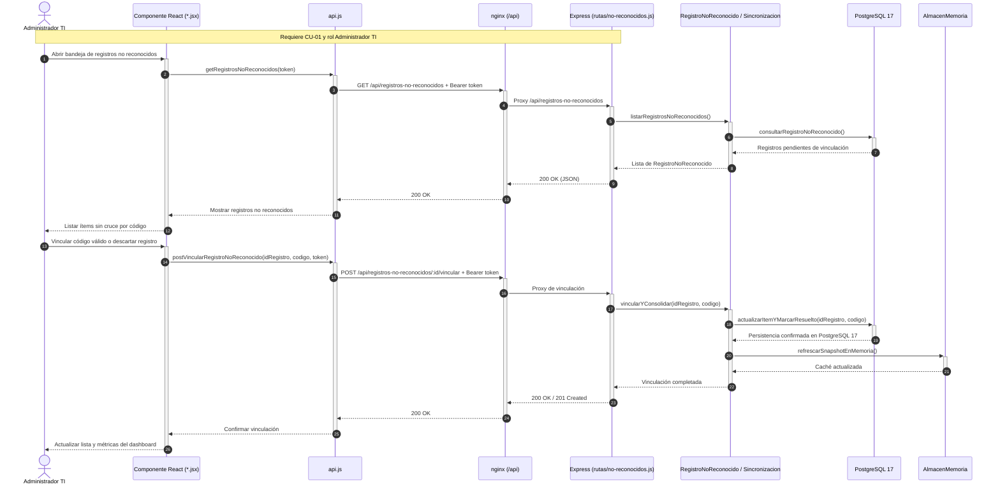

## CU-11: Revisar registros no reconocidos

```mermaid
sequenceDiagram
    autonumber
    actor Admin as Administrador TI
    participant UI as Componente React (*.jsx)
    participant Api as api.js
    participant Nginx as nginx (/api)
    participant Express as Express (rutas/no-reconocidos.js)
    participant Negocio as RegistroNoReconocido / Sincronizacion
    participant DB as PostgreSQL 17
    participant Cache as AlmacenMemoria

    Note over Admin,Express: Requiere CU-01 y rol Administrador TI

    Admin->>+UI: Abrir bandeja de registros no reconocidos
    UI->>+Api: getRegistrosNoReconocidos(token)
    Api->>+Nginx: GET /api/registros-no-reconocidos + Bearer token
    Nginx->>+Express: Proxy /api/registros-no-reconocidos
    Express->>+Negocio: listarRegistrosNoReconocidos()
    Negocio->>+DB: consultarRegistroNoReconocido()
    DB-->>-Negocio: Registros pendientes de vinculación
    Negocio-->>-Express: Lista de RegistroNoReconocido
    Express-->>-Nginx: 200 OK (JSON)
    Nginx-->>-Api: 200 OK
    Api-->>-UI: Mostrar registros no reconocidos
    UI-->>-Admin: Listar ítems sin cruce por código

    Admin->>+UI: Vincular código válido o descartar registro
    UI->>+Api: postVincularRegistroNoReconocido(idRegistro, codigo, token)
    Api->>+Nginx: POST /api/registros-no-reconocidos/:id/vincular + Bearer token
    Nginx->>+Express: Proxy de vinculación
    Express->>+Negocio: vincularYConsolidar(idRegistro, codigo)
    Negocio->>+DB: actualizarItemYMarcarResuelto(idRegistro, codigo)
    DB-->>-Negocio: Persistencia confirmada en PostgreSQL 17
    Negocio->>+Cache: refrescarSnapshotEnMemoria()
    Cache-->>-Negocio: Caché actualizada
    Negocio-->>-Express: Vinculación completada
    Express-->>-Nginx: 200 OK / 201 Created
    Nginx-->>-Api: 200 OK
    Api-->>-UI: Confirmar vinculación
    UI-->>-Admin: Actualizar lista y métricas del dashboard
```
